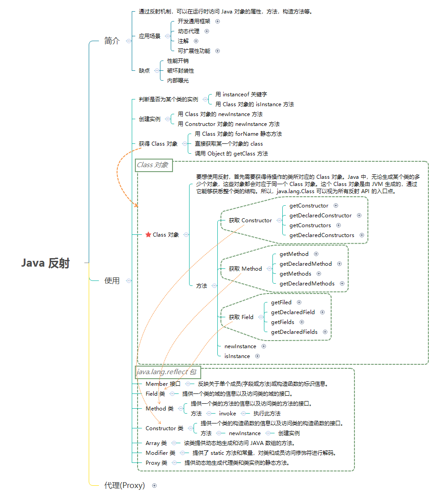

# java 规则

## 命名规则

> Java 程序源文件的命名不是随意的，Java 文件的命名必须满足如下规则。

1. Java 程序源文件的后缀必须是 .java，不能是其他文件后缀名。
2. 如果 Java 程序源代码里定义了一个 public 类，则该源文件的主文件名必须与该 public 类（也就是该类定义使用了 public 关键字修饰）的类名相同。
3. 如果 Java 程序源代码里没有定义任何 public 类，那么 Java 程序源程序的主文件名可以是任意的！
4. java 文件可以有多个类
5. 类名必须大写
6. 变量和方法首字母小写
7. 主函数必须写public 中
8. 很多代码需要放在方法中才能运行，不能放在类中
9. this 使用情况
    1. 构造函数中使用成员变量
    2. 构造函数使用构造函数时
    3. 方法中使用自己的类时
10. return是跳出函数并返回值
11. break则是跳出循环
12. continue则是跳过当前循环
13. `++a` `a++` 都是自增；前缀自增 先计算表达式  再自增；后缀自增 先自增再计算表达式
14. for 循环中要多使用 `++i` :i++语句是需要一个临时变量取存储返回自增前的值，而++i不需要。这样就导致使用i++时系统需要先申请一段内存空间，然后将值赛进去，最后不用了才去释放

## 反射

> 读取运行时的字节码文件，发生在类加载之后，jvm 会在内存中自动产生一个 Class 对象。



## java 8 特性

### Lambda 表达式

> Java 8 使用更简短的 lambda 表达式来避免常常创建匿名对象的问题

```java

// 1. 以前
Collections.sort(names, new Comparator<String>() {
    @Override
    public int compare(String a, String b) {
        return b.compareTo(a);
    }
});
// 2. jdk 8
// 2.1
Collections.sort(names, (String a, String b) -> {
    return b.compareTo(a);
});
// 2.2
Collections.sort(names, (String a, String b) -> b.compareTo(a));
// 2.3
names.sort((a, b) -> b.compareTo(a));
```

### 接口默认方法

```java
interface Formula {
    double calculate(int a);

    default double sqrt(int a) {
        return Math.sqrt(a);
    }
}
```

### Date api