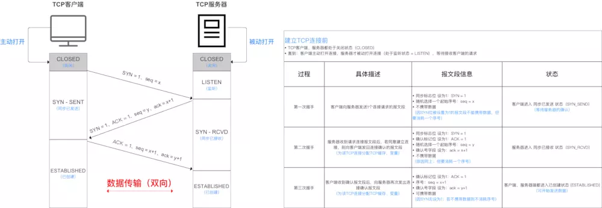
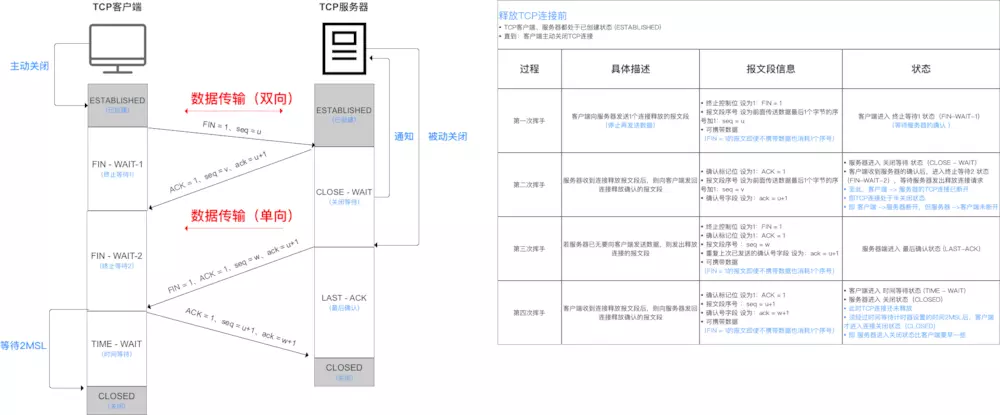
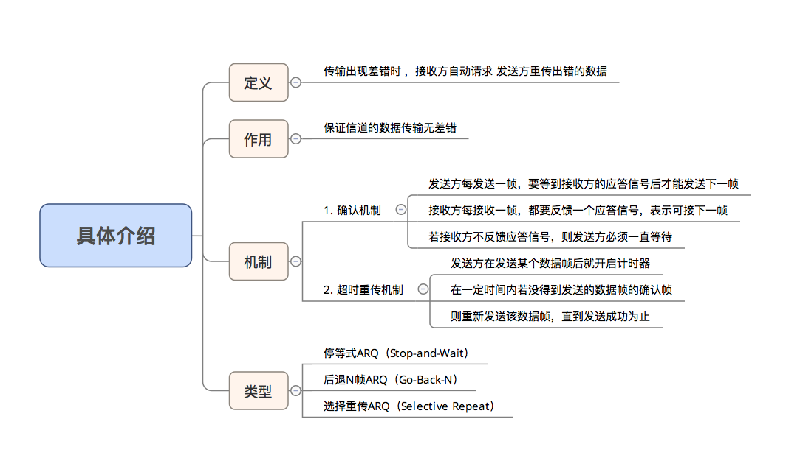
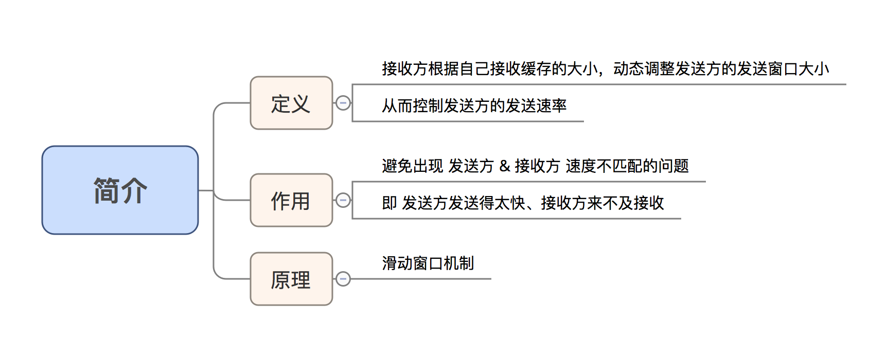
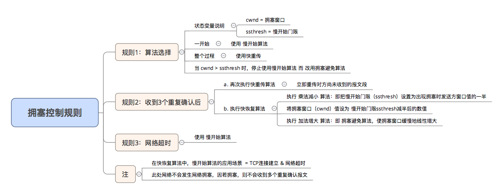

# 网络知识汇总

## 浏览网页的原理

1. 客户端第一开始 没有 ip 地址，需要使用dhcp(动态主机配置协议) 获取，使用 udp 协议

2. 为了获取网关路由器的 mac 地址，使用 arp 协议(地址解析协议)，通过 ip 地址找到 mac 地址
   
3. 客户端浏览器通过 DNS (udp)解析到`www.baidu.com`的IP地址`220.181.27.48`，通过这个IP地址找到客户端到服务器的路径。客户端浏览器发起一个HTTP会话到`220.161.27.48`，然后通过TCP进行封装数据包，输入到网络层。

4. 在客户端的传输层，把HTTP会话请求分成报文段，添加源和目的端口，如服务器使用80端口监听客户端的请求，客户端由系统随机选择一个端口如5000，与服务器进行交换，服务器把相应的请求返回给客户端的5000端口。然后使用IP层的IP地址查找目的端。

5. 客户端的网络层不用关心应用层或者传输层的东西，主要做的是通过查找路由表确定如何到达服务器，期间可能经过多个路由器，这些都是由路由器来完成的工作，我不作过多的描述，无非就是通过查找路由表决定通过那个路径到达服务器。

6. 客户端的链路层，包通过链路层发送到路由器，通过邻居协议查找给定IP地址的MAC地址，然后发送ARP请求查找目的地址，如果得到回应后就可以使用ARP的请求应答交换的IP数据包现在就可以传输了，然后发送IP数据包到达服务器的地址

## 网络模型

- OSI七层模型
    
    物理层、数据链路层、网络层、传输层、会话层、表示层、应用层。

- TCP/IP四层协议

    网络接口层、 网际层、运输层、 应用层。

- TCP/IP五层协议

    物理层、数据链路层、网络层、运输层、 应用层

- 网络层常见设备和协议
    
    协议：ip协议(因特网互联协议)，arp协议(地址解析)
    设备：路由器

- 传输层

    协议：tcp(传输控制协议)和udp(用户数据报协议)
    设备：网关

- 应用层

    协议：FTP、DNS、Telnet、SMTP、HTTP、WWW、NFS

## tcp 和 udp

> 用户数据报协议 UDP（User Datagram Protocol）是无连接的，尽最大可能交付，没有拥塞控制，面向报文
（对于应用程序传下来的报文不合并也不拆分，只是添加 UDP 首部），支持一对一、一对多、多对一和多对多
的交互通信。
> 传输控制协议 TCP（Transmission Control Protocol）是面向连接的，提供可靠交付，有流量控制，拥塞控
制，提供全双工通信，面向字节流（把应用层传下来的报文看成字节流，把字节流组织成大小不等的数据
块），每一条 TCP 连接只能是点对点的（一对一)

1. tcp 协议：ftp,http,telnet,pop3
2. udp 协议：dns,dhcp(动态主机配置协议)

### tcp

三次握手

> 为什么三次握手，防止失效的请求到达服务器，让服务器错误的打开连接。（连接请求在网络中滞留，客户端等待超时，重新请求，之前连接失效）

1. 服务器处于监听状态，等待客户的连接请求
2. 客户端向服务器发送请求报文，syn = 1,ack = 0,初始序号 x;
3. 服务器接收到连接请求报文，如果同意建立连接，向客户端发送确认报文，syn = 1,ack = 1,确认号 x+1,同时也选择一个初始的序号 y
4. 客户端收到服务器的连接确认报文后，还要向服务器进行确认，确认号为 y+1,序号为 x+1

四次挥手

> 为什么需要四次挥手：传递未发送完的数据。客户端发送了 FIN 连接释放报文之后，服务器收到了这个报文，就进入了 CLOSE-WAIT 状态。这个状态是为了让服务器端发送还未传送完毕的数据，传送完毕之后，服务器会发送 FIN 连接释放报文。
> 为什么要等待两 msl 
> * 2MSL = 最长报文段寿命,为了保证客户端发送的最后1个连接释放确认报文 能到达服务器，从而使得服务器能正常释放连接。
> * 经过2MSL时间，则可使本连接持续时间内所产生的所有报文段都从网络中消失。即 在下1个新的连接中就不会出现早已失效的连接请求报文。

1. 客户端发送连接释放报文，fin = 1
2. 服务端收到以后确认，此时 tcp 处于半关闭状态，服务器能向客户端发送数据，但是客户端不能向服务器发送数据
3. 服务器不需要再连接时，发送连接释放报文
4. 客户端收到后发出确认，进入 time-wait 状态，等待 2msl 后释放连接
5. 服务器收到客户端的确认后，释放连接

### tcp 协议为什么是安全的

> * 出现差错时，让发送方重传差错数据：即 出错重传
> * 当接收方来不及接收收到的数据时，可通知发送方降低发送数据的效率：即 速度匹配
> * 针对上述 2 个问题，分别采用的解决方案是：自动重传协议 和 流量控制 & 拥塞控制协议

自动重传规则

流量控制

拥塞控制

## dns ip

> 当DNS客户机需要在程序中使用名称时，它会查询DNS服务器来解析该名称。客户机发送的每条查询信息包括三条信息：包括：指定的DNS域名，指定的查询类型，DNS域名的指定类别。基于UDP服务，端口53. 该应用一般不直接为用户使用，而是为其他应用服务，如HTTP，SMTP等在其中需要完成主机名到IP地址的转换。

## http 和 https

### http

> HTTP协议全称Hyper Text Transfer Protocol，翻译过来就是超文本传输协议，位于TCP/IP四层模型当中的应用层。默认80端口

1. 传输层的TCP是基于网络层的IP协议的，而应用层的HTTP协议又是基于传输层的TCP协议的，而Socket本身不算是协议，就像上面所说，它只是提供了一个针对TCP或者UDP编程的接口。
2. HTTP协议通过请求/响应的方式，在客户端和服务端之间进行通信
3. HTTP协议的信息传输完全以明文方式，不做任何加密，相当于是在网络上“裸奔”

#### http 请求过程

1. 客户端连接到 Web 服务器
    1. 一个 HTTP 客户端， 通常是浏览器， 与 Web 服务器的 HTTP 端口（默认为 80） 建立一个 TCP 套接字连接。 例如 `http://www.oakcms.cn`
2. 发送 HTTP 请求
    1. 通过 TCP 套接字， 客户端向 Web 服务器发送一个文本的请求报文， 一个请求报文由请求行.   请求头部.   空行和请求数据 4 部分组成。
3. 服务器接受请求并返回 HTTP 响应
    1. Web 服务器解析请求， 定位请求资源。 服务器将资源复本写到 TCP 套接字， 由客户端读取。 一个响应由状态行.   响应头部.   空行和响应数据 4 部分组成。
4. 释放连接 TCP 连接
   1. 若 connection 模式为 close， 则服务器主动关闭 TCP 连接， 客户端被动关闭连接，释放 TCP 连接;若 connection 模式为 keepalive， 则该连接会保持一段时间， 在该时间内可以继续接收请求;
5. 客户端浏览器解析 HTML 内容

#### 对称加密方式

> 对称加密方式，并且约定一个随机生成的密钥。后续的通信中，信息发送方都使用密钥对信息加密，而信息接收方通过同样的密钥对信息解密。

> 但是第一次约定加密方式和密钥的通信仍然是明文，如果第一次通信就已经被拦截了，那么密钥就会泄露给中间人，中间人仍然可以解密后续所有的通信内容。

1. 服务端把加密方式和密钥传递给客户端(加密方式和密钥是明文)
2. 客户端接收加密信息
3. 加密通信明文，开始进行传递
4. 对称加密算法：AES，RC4，3DES
5. HASH算法：MD5，SHA1，SHA256

#### 非对称加密

> 非对称加密，为密钥的传输做一层额外的保护。非对称加密的一组秘钥对中，包含一个公钥和一个私钥。明文既可以用公钥加密，用私钥解密；也可以用私钥加密，用公钥解密
 
1. 服务端和客户端建立通信，服务端首先把自己的公钥 Key1 发给客户端：
2. 接收到服务端公钥，客户端自己生成一个用于对称加密的密钥 Key2，并且用刚才接收的公钥 Key1 对 Key2 进行加密（这里有点绕），发送给服务端：
3. 服务端利用自己非对称加密的私钥，解开了公钥Key1的加密，获得了Key2的内容。从此以后，客户端和服务端就可以利用 Key2进行对称加密的通信了
4. 破解流程：
5. 截获服务端的公钥Key1，自己另外生成一对公钥私钥，
6. 把自己的公钥Key3发送给客户端。然后破解出客户端传递过来的 key2,
7. 利用key1 加密 key2,发送给服务端，中间人就可以解密信息
8. 非对称加密算法：RSA，DSA/DSS

### https

> 引入第三方，一个权威的证书颁发机构（CA）来解决。证书一般包括证书颁发机构，服务端网址，服务端公钥（机构私钥加密），证书签名（机构私钥加密），默认 443端口

https 在 http 的基础上增加了 ssl 安全层，认证流程在 ssl 层中完成，ssl 属于传输层

1.  服务端把公钥 key1 发给证书办法机构，申请证书
2.  机构利用自己的私钥加密服务端公钥 key1
3.  通过服务端网址等信息生成证书签名，并通过私钥加密
4.  机构把证书发给服务端
5.  客户端请求通信，服务端将证书传给客户端
6.  客户端通过浏览器和操作系统找到本地的证书机构名称和机构的公钥
7.  解密证书签名
8.  客户端向机构请求生成证书签名，和本地接受证书签名比较
9.  证书签名一致，证书有效，利用机构公钥解密服务端公钥 key1
10. 利用公钥 key1 加密客户端生成的对称加密密钥 key2
11. 发送给服务端
12. 服务端通过 key1 的私钥解密，得到对称加密密钥 key2.
13. 客户端和服务端开始利用 key2 进行对称加密的通信

## http 报头

### 请求头

1. 通用
   1. content-type 请求类型
   2. accept 接受类型
   3. content-length 长度
2. 请求
   1.  Authorization 设置身份认证信息
   2.  user-Agent 用户标识
   3.  cookie cookie
   4.  host 请求的主机和端口
   5.  if-Modified-since 上次服务器返回的修改值
3. 响应
   1. date 服务器日期
   2. last-modified 资源最后修改时间
   3. set-cookie 设置cookie
   4. Server 后台服务器  
4. 状态码
   1. 2XX成功
      1. 200 成功处理了请求
      2. 201 请求成功并创建了新的资源
      3. 202 接受请求但未处理 
   2. 3XX重定向
      1. 301 Moved Permanently 永久性重定向，请求的资源已经分配了新的URI，以后应该使用资源现在所指的URI
      2. 302 Found 临时性重定向，请求的资源临时分配了新的URI，希望用户本次可以使用新的URI访问
      3. 304 Not Modified 服务器端资源未改变，可直接使用客户端未过期的缓存，不包含任何响应的主体部分 
   3. 4XX客户端错误
      1. 400 Bad Request  请求报文中存在语法错误
      2. 401 Unauthorized 请求需要有通过HTTP认证的认证信息。另外如果之前已进行一次请求，则表示用户认证失败
      3. 403 Forbidden 对请求资源的访问被服务器拒绝了，如未获得文件系统的访问授权，访问权限出现某些问题
      4. 404 Not Found 服务器上没有请求的资源
   4. 5XX服务器错误
      1. 500 Internal Server Error 服务器在执行请求时发生了错误
      2. 503 Service Unavailable 无法处理请求

### 请求报文

> * 请求行：方法字段，url 字段，http 协议版本。例如 GET /index.html HTTP/1.1
> * 请求头部：请求头部由关键字/值对组成，每行一对，关键字和值用英文冒号“:”分隔
> * 空行：最后一个请求头之后是一个空行，发送回车符和换行符，通知服务器以下不再有请求头
> * 请求数据：请求包体不在 GET 方法中使用，而是在POST 方法中使用。POST 方法适用于需要客户填写表单的场合

### 响应报文

> * 状态行：HTTP-Version表示服务器HTTP协议的版本；Status-Code表示服务器发回的响应状态代码；Reason-Phrase表示状态代码的文本描述；CRLF就是回车换行，例如 HTTP/1.1 200 OK   text/html\r\n
> * 消息报头：
> * 空行：
> * 响应正文：服务器返回给客户端的文本信息。

### http 请求响应过程

* 客户端连接到web服务器：HTTP 客户端与web服务器建立一个 TCP 连接;

* 客户端向服务器发起 HTTP 请求：通过已建立的TCP 连接，客户端向服务器发送一个请求报文;

* 服务器接收 HTTP 请求并返回 HTTP 响应：服务器解析请求，定位请求资源，服务器将资源副本写到 TCP 连接，由客户端读取;

* 释放 TCP 连接：若connection 模式为close，则服务器主动关闭TCP 连接，客户端被动关闭连接，释放TCP 连接;若connection 模式为keepalive，则该连接会保持一段时间，在该时间内可以继续接收请求;

* 客户端浏览器解析HTML内容：客户端将服务器响应的 html 文本解析并显示;

## get 和 post 的区别

> GET一般用于获取/查询资源信息，而POST一般用于更新资源信息。

1. 我们可以看到GET请求消息体为空，POST请求带有消息体。
2. GET提交的数据会放在URL之后，以?分割URL和传输数据，参数之间以&相连，如 `EditPosts.aspx?name=test1&id=123456。`POST方法是把提交的数据放在HTTP包的body中。
3. GET提交的数据大小有限制（因为浏览器对URL的长度有限制），而POST方法提交的数据没有限制。
4. GET方式提交数据，会带来安全问题，比如一个登录页面，通过GET方式提交数据时，用户名和密码将出现在URL上，如果页面可以被缓存或者其他人可以访问这台机器，就可以从历史记录获得该用户的账号和密码

## session cookie

> HTTP协议是一种"无状态"协议，客户浏览器与服务器建立连接，发出请求，得到相应，然后关闭连接，这意味着每次客户端检索网页时，客户端打开一个单独的连接到 Web 服务器，服务器会自动不保留之前客户端请求的任何记录。因此用户需要一个唯一会话 id

### cookie

> Cookie是客户端保存用户信息的一种机制，用来记录用户的一些信息，也是实现Session的一种方式，也可以跟踪用户信息

### session

> Session是在服务端保存的一个数据结构，用来跟踪用户的状态，这个数据可以保存在集群、数据库、文件中

### 区别

1. session 在服务器端，cookie 在客户端（浏览器）
2. session 默认被存在在服务器的一个文件里（不是内存）
3. session 的运行依赖 session id，而 session id 是存在 cookie 中的，也就是说，如果浏览器禁用了 cookie ，同时 session 也会失效（但是可以通过其它方式实现，比如在 url 中传递 session_id）
4. session 可以放在 文件、数据库、或内存中都可以。
5. 用户验证这种场合一般会用 session 因此，维持一个会话的核心就是客户端的唯一标识，即 session id

## socket

> Socket 是对 TCP/IP 协议族的一种封装，是应用层与TCP/IP协议族通信的中间软件抽象层。从设计模式的角度看来，Socket其实就是一个门面模式，它把复杂的TCP/IP协议族隐藏在Socket接口后面，对用户来说，一组简单的接口就是全部，让Socket去组织数据，以符合指定的协议

> 端口号时用来区分进程的，这样 ip 层传过来的数据到达 tcp 后就可以分给各个程序

### udp socket 编码

发送方

1. 首先创建udp的socket服务

2. 将需要发送的数据放在数据包DatagramSocket中，DatagramSocket会根据UDP协议对数据包、IP、端口号进行封装

3. 通过udp的socket服务将数据包发送

4. 最后将udp服务关闭

接受方

1. 创建udp的socket服务，并且明确自己的端口号

2. 创建DatagramSocket用来解析数据接收到的数据包

3. 将数据接收到数据包DatagramSocket中

4. 通过DatagramSocket解析数据

5. 关闭服务

### tcp socket 编码

客户端

1. 首先创建一个Socket和InetSocketAddress 
2. 然后通过Socket的connect()方法进行连接
3. 连接成功后可以获取到输出流
4. 通过该输出流就可以向服务端传输数据。

服务端

1. 首先创建一个服务端Socket并明确端口号
2. 通过accept()方法获取到链接过来的客户端Socket
3. 多线程，轮询 accept ，每有一个新建一个线程
4. 从客户端Socket中获取输入流，最后由输入流读取客户端传输来的数据。

## ping

> * 是 ICMP(网际控制报文协议)报文的1个重要应用：使用了IPCM回送请求 & 回送回答报文
> * 作用 测试2个主机的连通性

1. 是应用层直接使用网络层ICMP的1个例子，无经过传输层的TCP、UDP
2. 原理
   1. 向目的主机发送多个ICMP回送请求报文
   2. 根据 目的主机返回的ICMP回送回答报文中的时间戳，从而计算出往返时间
   3. 最终显示的结果：发送到目的主机的IP地址、发送 & 收到 & 丢失的分组数、往返时间的最小、最大 & 平均值

## 物理地址和 ip 地址

> arp：作用是把IP地址转换为对应的Ethernet MAC地址。
> DHCP用来从DHCP server得到IP地址。
> 1：首先，每个主机都会在自己的ARP缓冲区中建立一个ARP列表，以表示IP地址和MAC地址之间的对应关系。
> 2：当源主机要发送数据时，首先检查ARP列表中是否有对应IP地址的目的主机的MAC地址如果有，则直接发送数据，如果没有，就向本网段的所有主机发送ARP数据包该数据包包括的内容有：源主机 IP地址，源主机MAC地址，目的主机的IP 地址。
> 3：当本网络的所有主机收到该ARP数据包时，首先检查数据包中的IP地址是否是自己的IP地址，如果不是，则忽略该数据包，如果是，则首先从数据包中取出源主机的IP和MAC地址写入到ARP列表中，如果已经存在，则覆盖，然后将自己的MAC地址写入ARP响应包中，告诉源主机自己是它想要找的MAC地址。
> 4：源主机收到ARP响应包后。将目的主机的IP和MAC地址写入ARP列表，并利用此信息发送数据。如果源主机一直没有收到ARP响应数据包，表示ARP查询失败。广播发送ARP请求，单播发送ARP响应。

1. 对于网络上的某一设备，如一台计算机或一台路由器，其IP地址可变（但必须唯一），而MAC地址不可变。我们可以根据需要给一台主机指定任意的IP地址，如我们可以给局域网上的某台计算机分配IP地址为192.168.0.112 ，也可以将它改成192.168.0.200。而任一网络设备（如网卡，路由器）一旦生产出来以后，其MAC地址永远唯一且不能由用户改变。

2. 长度不同。IP地址为32位，MAC地址为48位。

3. 分配依据不同。IP地址的分配是基于网络拓朴，MAC地址的分配是基于制造商。

4. 寻址协议层不同。IP地址应用于OSI第三层，即网络层，而MAC地址应用在OSI第二层，即数据链路层。 数据链路层协议可以使数据从一个节点传递到相同链路的另一个节点上（通过MAC地址），而网络层协议使数据可以从一个网络传递到另一个网络上（ARP根据目的IP地址，找到中间节点的MAC地址，通过中间节点传送，从而最终到达目的网络）

## WebSocket

> websocket是HTML5的一个新协议，它允许服务端向客户端传递信息，实现浏览器和客户端双工通信,服务器可以主动向客户端推送信息，客户端也可以主动向服务器发送信息，是真正的双向平等对话

1. http 只允许 客户端向服务端发送数据
2. 与 HTTP 协议有着良好的兼容性。默认端口也是 80 和 443 ，并且握手阶段采用 HTTP 协议，因此握手时不容易屏蔽，能通过各种 HTTP 代理服务器。 
3. 建立在TCP协议基础之上，和http协议同属于应用层数据格式比较轻量，性能开销小，通信高效。(没有http臃肿的头部)
4. 可以发送文本，也可以发送二进制数据。 
5. 没有同源限制，客户端可以与任意服务器通信协议标识符是ws（如果加密，则为wss），服务器网址就是 URL,如ws://localhost:8023

## ajax

> 指一种创建交互式网页应用的网页开发技术。客户端与服务器，可以在【不必刷新整个浏览器】的情况下，与服务器进行异步通讯的技术

实现流程

1. 创建XMLHttpRequest对象,也就是创建一个异步调用对象.
2. 创建一个新的HTTP请求,并指定该HTTP请求的方法、URL及验证信息.
3. 设置响应HTTP请求状态变化的函数.
4. 发送HTTP请求.
5. 获取异步调用返回的数据.
6. 使用JavaScript和DOM实现局部刷新.

---

## 参考链接

1. [小灰https](https://mp.weixin.qq.com/s/1ojSrhc9LZV8zlX6YblMtA)
2. [socket编程](https://mp.weixin.qq.com/s/UD5S-MTF4ic6NZmW4ZZaxQ)
3. [总结](https://juejin.im/post/5ad7e6c35188252ebd06acfa)
4. [http 协议](https://blog.csdn.net/sinat_21455985/article/details/51000246)