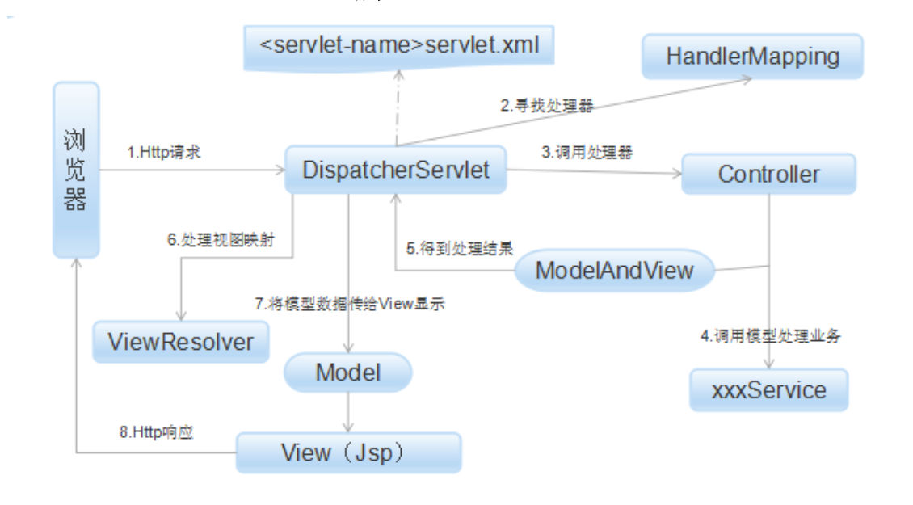

# spring

## 1. spring 基本原理

### 1.1 ioc

> 反转控制，类的创建过程由 spring 来实现
> * 好处：资源交由第三方管理，降低耦合；不需要再 new 对象
> * 依赖注入（dl）: 在系统运行过程中，动态的向某个对象注入它所依赖的对象
> IOC 容器：负责组件的装配

1. 依赖注入
   1. **谁依赖于谁**：当然是应用程序依赖于 IoC 容器；
   2. **为什么需要依赖**：应用程序需要 IoC 容器来提供对象需要的外部资源；
   3. **谁注入谁**：很明显是 IoC 容器注入应用程序某个对象，应用程序依赖的对象；
   4. **注入了什么**：就是注入某个对象所需要的外部资源（包括对象、资源、常量数据）。
2. ioc 容器
    1. 由 IoC 容器管理的那些组成应用程序的对象我们就叫它 Bean。Bean 就是由 Spring 容器初始化、装配及管理的对象
       1. bean 的创建：**工厂模式**
       2. 作用域：单例，原型，request,session
       3. 生命周期
          1. 初始化一个 bean ,new
          2. 注入
          3. 根据 bean 类型分类处理
          4. 销毁
    2. 工作流程
       1. 系统启动：*读取*应用程序提供的 *Bean 配置信息*，并在 Spring 容器中*生成*一份相应的 *Bean 配置注册表*
       2. 实例化 Bean: 实例化 bean,装配 Bean 之间的依赖关系
       3. 存入缓存池：Bean 缓存池为 HashMap 实现
3. 数据如何注入
   1. **反射** 
   2. 三种注入方式：构造器，接口，set 注入

### 1.2 aop

> AOP 即 Aspect Oriented Program 面向切面编程 
> 首先，在面向切面编程的思想里面，把功能分为核心业务功能，和周边功能。 
> 所谓的核心业务，比如登陆，增加数据，删除数据都叫核心业务 
> 所谓的周边功能，比如性能统计，日志，事务管理等等 
> 周边功能在Spring的面向切面编程AOP思想里，即被定义为切面 
> 在面向切面编程AOP的思想里面，核心业务功能和切面功能分别独立进行开发 
> 然后把切面功能和核心业务功能 "编织" 在一起，这就叫AOP

1. 原理
```java
// 切面
<aop:config>
    // 声明切入点，切入点 id : loggerCutpoint
    <aop:pointcut id="loggerCutpoint"
        // 满足expression中的方法调用之后，就会去进行切面操作，类似于触发了切面，业务类调用辅助类
        expression="execution(* com.how2java.service.ProductService.*(..)) "/>
    // 定义一个 logAspect 切面，ref 方法所在的类，method 方法    
    <aop:aspect id="logAspect" ref="loggerAspect">
        // 该切面和切入点关联起来
        <aop:after pointcut-ref="loggerCutpoint" method="log"/>
    </aop:aspect>
</aop:config> 
```

2. Spring 提 供了 两种 方 式来 生 成代 理 对象: JDKProxy 和 Cglib ， 
   1. 具 体使用 哪 种方 式 生成由AopProxyFactory 根据 AdvisedSupport 对象的配置来决定。 
   2. 默认的策略是如果目标类是接口，则使用 JDK 动态代理技术，否则使用 Cglib 来生成代理

3. JDK 动态代理主要涉及到 java.lang.reflect 包中的两个类： Proxy 和 InvocationHandler。
   1. InvocationHandler 是一个接口，通过实现该接口定义横切逻辑，并通过反射机制调用目标类的代码，动态将横切逻辑和业务逻辑编制在一起。 
   2. Proxy 利用 InvocationHandler 动态创建一个符合某一接口的实例，生成目标类的代理对象。
4. CGLib 
   1. 可以在运行期扩展 Java 类与实现 Java 接口
   2. JDK 创建代理有一个限制，就是只能为接口创建代理实例


### 1.3 常用注解

1. `@Controller`
    * 用于标注控制层组件
2. `@Service`
    * 服务层组件，用于标注业务层组件
3. `@Component`
   * 泛指组件，当组件不好归类的时候，我们可以使用这个注解进行标注
4. `@GetMapping`
   * method为get请求的@RequestMapping简写
5. `@PostMapping`
   * method为post请求的@RequestMapping简写
6. `@RequestMapping`
   * 处理请求地址映射的注解，可用于类或方法上
   * 用于类上，表示类中的所有响应请求的方法都是以该地址作为父路径
7. `@Autowired`
   * 对类成员变量、方法及构造函数进行标注，完成自动装配的工作
   * 通过 @Autowired的使用来消除 set ，get方法
   * 默认是按照byType进行注入的
8. `@ResponseBody`
   * 表示该方法的返回结果直接写入HTTP response body中
   * 一般在异步获取数据时使用，在使用@RequestMapping后，返回值通常解析为跳转路径，加上@responsebody后返回结果不会被解析为跳转路径，而是直接写入HTTP response body中。比如异步获取json数据，加上@responsebody后，会直接返回json数据。
9. `@Scheduled`
10. `@InitBinder`
    * 绑定请求参数到指定的属性编辑器，解决类型的转换问题
11. `@Pointcut`
    * 声明切入点表达式，一般在该方法中不再添加其他代码
12. `@Around`
    * 环绕通知，围绕着方法执行
13. `@Aspect`
    * 配置在类上，把这个类声明为一个切面：需要把该类放入到IOC容器中，再声明为一个切面
14. `@Order`
    * 指定切面的优先级，当有多个切面时，数值越小优先级越高
15. `@TableName`
    * 表名注解
16. `@TableField`
    * 字段注解
17. `@TableId`
    * 主键注解
  
## 2. spring mvc 原理



## 3. myBatis 原理

### 3.1 jdbc

> Java程序都是通过JDBC连接数据库的，通过SQL对数据库编程，JDBC是由SUN公司提出的一些列规范，只定义了接口规范
> 所谓规范，就是自己定义了标准接口，做了如下抽象：
> 用Connection代表和数据库的连接
> 用Statement执行SQL
> 用ResultSet表示SQL返回的结果，提供了对数据的便利
> 从Connection可以创建Statement，Statement执行查询得到ResultSet

### 3.2 mybatis

> Hibernate属于全自动ORM映射工具，使用Hibernate查询关联对象或者关联集合对象时，可以根据对象关系模型直接获取，所以它是全自动的。
> 而Mybatis在查询关联对象或关联集合对象时，需要手动编写sql来完成，所以，称之为半自动ORM映射工具

1. mybatis通过JDK的动态代理方式，在启动加载配置文件时，根据配置mapper的xml去生成Dao的实现
2. mapper 接口
   1. Mapper接口是没有实现类的，当调用接口方法时，接口全限名+方法名拼接字符串作为key值
   2. 接口里的方法，是不能重载的，因为是全限名+方法名的保存和寻找策略。
   3. Mybatis运行时会使用JDK动态代理为Dao接口生成代理proxy对象，代理对象proxy会拦截接口方法，转而执行MappedStatement所代表的sql，然后将sql执行结果返回
3. 原理

```java
SqlSessionFactory sqlSessionFactory = new SqlSessionFactoryBuilder().build(inputStream);
SqlSession session=sqlSessionFactory.openSession

Category c= session.selectOne("getCategory",3);
```

4. 组件生命周期
   1. SqlSessionFactory在MyBatis应用的整个生命周期中，每个数据库只对应一个SqlSessionFactory，可以实现一个工具类，以单例模式获取该对象。
   2. SqlSession的生命周期在请求数据库处理事务的过程中，它是一个线程不安全的对象，在涉及多线程的时候要特别当心。它存活于一个应用的请求和操作，可以执行多条SQL，保证事务的一致性。
   3. Mapper的作用是发送SQL，然后返回需要的结果，或者执行SQL修改数据库的数据，所以它应该在一个SqlSession事务方法之内，如同JDBC中一条SQL语句的执行，它最大的范围和SqlSession是相同的

5. xml 文件

```xml
<!--1. 结果,声明返回的实体类-->
  <resultMap id="BaseResultMap" type="com.how2java.tmall.pojo.Category">
    <id column="id" jdbcType="INTEGER" property="id" />
    <result column="name" jdbcType="VARCHAR" property="name" />
  </resultMap>
<!--2. 具体sql配置-->
  <update id="updateByPrimaryKey" parameterType="com.how2java.tmall.pojo.Category">
    update category
    <!--#{}解析传递进来的参数数据，${}是字符串替换-->
    set name = #{name,jdbcType=VARCHAR}
    where id = #{id,jdbcType=INTEGER}
  </update>
```

### 3.3 myBatis 一级缓存

1. 实现的方式是每一个 SqlSession 中都持有了自己的缓存
   1. 一种是 SESSION 级别，即在一个 Mybatis 会话中执行的所有语句，都会共享这一个缓存
   2. 一种是 STATEMENT 级别，可以理解为缓存只对当前执行的这一个 statement 有效
2. 实现过程
   1. 每一个 SqlSession 中持有了自己的 Executor，每一个 Executor 中有一个 Local Cache。
   2. 当用户发起查询时，Mybatis 会根据当前执行的 MappedStatement 生成一个 key，去 Local Cache 中查询，
   3. 如果缓存命中的话，返回。如果缓存没有命中的话，则写入 Local Cache，最后返回结果给用户
3. Mybatis 一级缓存的生命周期和 SqlSession 一致。
4. Mybatis 的缓存是一个粗粒度的缓存，没有更新缓存和缓存过期的概念，同时只是使用了默认的 hashmap，也没有做容量上的限定。
5. Mybatis 的一级缓存最大范围是 SqlSession 内部，有多个 SqlSession 或者分布式的环境下，有操作数据库写的话，会引起脏数据
6. 建议是把一级缓存的默认级别设定为 Statement，即不使用一级缓存

### 3.4 myBatis 二级缓存

> 一级缓存中，其最大的共享范围就是一个 SqlSession ，二级缓存可以让多个 SqlSession 之间也可以共享缓存

1. Mybatis 的二级缓存相对于一级缓存来说，实现了 SqlSession 之间缓存数据的共享，同时粒度更加的细，能够到 Mapper 级别，通过 Cache 接口实现类不同的组合，对 Cache 的可控性也更强。

2. Mybatis在多表查询时，极大可能会出现脏数据，有设计上的缺陷，安全使用的条件比较苛刻。

3. 在分布式环境下，由于默认的 Mybatis Cache 实现都是基于本地的，分布式环境下必然会出现读取到脏数据，需要使用集中式缓存将 Mybatis 的 Cache 接口实现，有一定的开发成本，不如直接用 Redis，Memcache 实现业务上的缓存就好了
4. [缓存原理](https://mp.weixin.qq.com/s?__biz=MzIwNjEwNTQ4Mw==&mid=2651577015&idx=1&sn=a34f7681fdafc886fe77d2cfd52e5c77&chksm=8cd9c453bbae4d45738641644a6553c29fa2e370495f3d2fa7cfdf62b0d7d0c32a1c467df981#rd)

## 4. redis 原理

> 内存数据库，数据结构简单，单线程，采用 多路 I/O 复用，内存结构类似于 hashmap

1. [redis 原理](https://www.cnblogs.com/kismetv/p/8654978.html)
2. [redis 面经](https://dunwu.github.io/javaweb/#/technology/cache/cache-interview)

## 5. tomcat 原理

> tomcat 是一个 web 服务器，和 servlet,jsp 容器，返回浏览器动态资源

### 5.1 servlet 原理

> spring mvc 的核心 DispatcherServlet 是整个 SpringMvc 的入口
> 由于Servlet是单例的，当多个用户访问Servlet的时候，服务器会为每个用户创建一个线程。当多个用户并发访问Servlet共享资源的时候就会出现线程安全问题。
> 如果一个变量需要多个用户共享，则应当在访问该变量的时候，加同步机制synchronized (对象){}
> 如果一个变量不需要共享，则直接在 doGet() 或者 doPost()定义.这样不会存在线程安全问题

```xml
<!--1. 创建一个servlet,指定url 交给哪个 servlet 处理-->
<servlet>
    <servlet-name>Spring web</servlet-name>
    <servlet-class>org.springframework.web.servlet.DispatcherServlet</servlet-class>
    <load-on-startup>1</load-on-startup>
</servlet>

  <servlet-mapping>
    <servlet-name>Spring web</servlet-name>
    <!--servlet 匹配规则-->
    <url-pattern>/*</url-pattern>
  </servlet-mapping>
    <!--对应 servlet 的映射配置文件-->
  <beans>
    <bean id="simpleUrlHandlerMapping"
        class="org.springframework.web.servlet.handler.SimpleUrlHandlerMapping">
        <property name="mappings">
            <props>
                <!--/index 交给 indexController bean 处理-->
                <prop key="/index">indexController</prop>
            </props>
        </property>
    </bean>
    <!-- indexController bean 的配置类 为indexController-->
    <bean id="indexController" class="controller.IndexController"></bean>
</beans>
```

### 5.2 tomcat 原理

> 常见 web 服务器 nginx apache jetty

1. 作用
   1. 提供 socket 服务
   2. 进行请求的分发
      1. tomcat 支持多个 web 应用
   3. 把请求和响应，封装成 request/response
2. 原理
   1. 建立 socket 服务
   2. 封装请求对象：通过输入流，对 http 进行解析，拿到请求的方法和url 
   3. 封装响应对象：以 http 协议格式写入输出流
   4. 通过类加载器使用 Servlet类对应的文件加载 Servlet (利用反射实例化具体的Servlet进行处理)
3. tomcat 建立 servlet 过程
   1. 当容器启动时，会读取在webapps目录下所有的web应用中的web.xml文件，然后对 xml文件进行解析，并读取servlet注册信息。
   2. 然后，将每个应用中注册的servlet类都进行加载，并通过 反射的方式实例化。（有时候也是在第一次请求时实例化）
   3. 在servlet注册时加上1如果为正数，则在一开始就实例化，如果不写或为负数，则第一次请求实例化。
  
### 5.3 面试题

* [tomcat面试题](https://juejin.im/post/5a75ab4b6fb9a063592ba9db)

## 6. ngix
